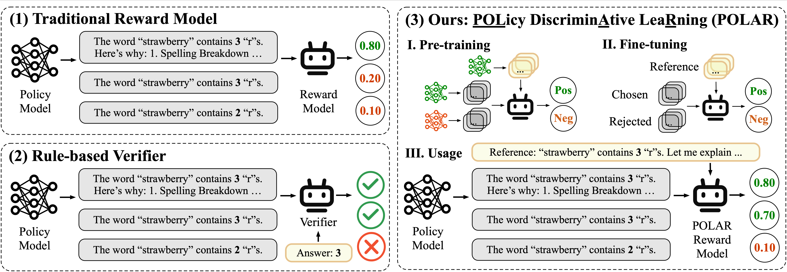
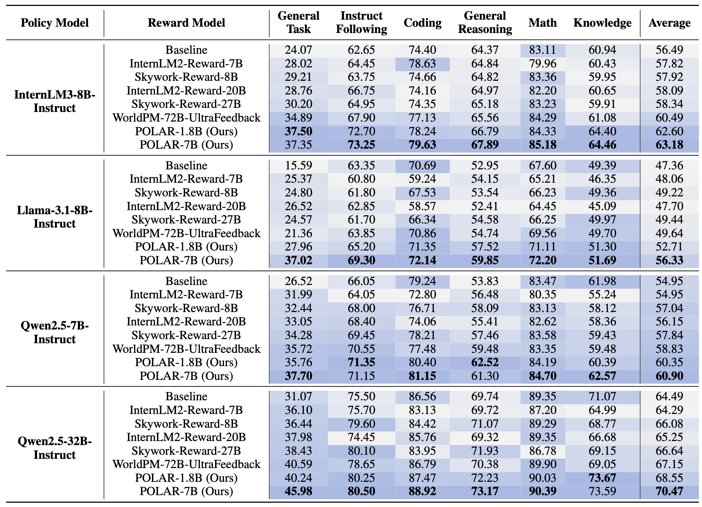

<div align="center">

<br>


[](./LICENSE)
[](https://github.com/InternLM/xtuner/)
[](https://github.com/InternLM/lmdeploy/)
[](https://github.com/sgl-project/sglang/)
[](https://github.com/vllm-project/vllm/)
[](https://github.com/volcengine/verl)


[🤗 HuggingFace](https://huggingface.co/collections/internlm/polar-68693f829d2e83ac5e6e124a) |
[🤖 ModelScope](https://www.modelscope.cn/organization/Shanghai_AI_Laboratory) |
[📜 Paper](https://arxiv.org/abs/2507.05197)<br>


[English](./README.md) |
[简体中文](./README_zh-CN.md)

</div>

# Latest News 🎉

- **[2025/09]** POLAR now supports RFT (Reinforcement Fine-tuning) training using VERL.

<br>

# Introduction

POLAR represents a significant breakthrough in scalar-based reward models achieved through large-scale pre-training. It leverages the innovative **POL**icy Discrimin**A**tive Lea**R**ning (**POLAR**) paradigm——a scalable, high-level optimization objective——to effectively discriminate between policies using a large-scale synthetic corpora. Following pre-training, POLAR RMs are fine-tuned with minimal preference data, rapidly aligning with human preferences. Key features of POLAR include:

* **Innovative Pre-training Paradigm:**  POLAR trains a reward model to discern identical policies and discriminate different ones. Unlike traditional reward modeling methods relying on absolute preferences, POLAR captures the relative difference between two policies, which is a scalable, high-level optimization objective suitable for modeling generic ranking relationships.

* **Tailored for Reinforcement Fine-tuning:** POLAR assigns rewards to LLM trajectories based on given references, perfectly aligning with the Reinforcement Fine-tuning (RFT) framework. POLAR provides a promising solution for applying RFT in generic scenarios.

* **Superior Performance and Generalization:** POLAR achieves state-of-the-art results on downstream reinforcement learning tasks, consistently delivering accurate and reliable reward signals that generalize effectively to unseen scenarios and significantly reducing reward hacking.

* **Easy to Customize:** Pre-trained checkpoints of POLAR are available, enabling researchers to conveniently fine-tune the RM for various customized scenarios, thus facilitating straightforward adaptation and expansion tailored to specific applications and experimental requirements.


<br>


# Model Zoo

We release POLAR reward models in sizes of 1.8B and 7B parameters. The "base" models (POLAR-1.8B-Base and POLAR-7B-Base) refer to pre-trained-only checkpoints, ideal for customized fine-tuning according to specific preferences. The "ready-to-use" checkpoints (POLAR-1.8B and POLAR-7B) have been already fine-tuned on general preference data, making them suitable for immediate use in most scenarios.

| Model                      | Transformers(HF)                           | ModelScope(HF)                           |
| -------------------------- | ------------------------------------------ | ---------------------------------------- |
| **POLAR-1.8B-Base**       | [🤗 POLAR-1_8B-Base](https://huggingface.co/internlm/POLAR-1_8B-Base) | [🤖 POLAR-1_8B-Base](https://modelscope.cn/models/Shanghai_AI_Laboratory/POLAR-1_8B-Base/summary) |
| **POLAR-1.8B**  | [🤗 POLAR-1_8B](https://huggingface.co/internlm/POLAR-1_8B) | [🤖 POLAR-1_8B](https://modelscope.cn/models/Shanghai_AI_Laboratory/POLAR-1_8B/summary) |
| **POLAR-7B-Base**         | [🤗 POLAR-7B-Base](https://huggingface.co/internlm/POLAR-7B-Base) | [🤖 POLAR-7B-Base](https://modelscope.cn/models/Shanghai_AI_Laboratory/POLAR-7B-Base/summary) |
| **POLAR-7B**    | [🤗 POLAR-7B](https://huggingface.co/internlm/POLAR-7B) | [🤖 POLAR-7B](https://modelscope.cn/models/Shanghai_AI_Laboratory/POLAR-7B/summary) |


# Performance

We conducted a comprehensive evaluation of POLAR via the Proximal Policy Optimization (PPO) algorithm. We evaluate the downstream RL performances of four different policy models using [OpenCompass](https://github.com/internLM/OpenCompass/). More details are available in our [Paper](https://arxiv.org/abs/2507.05197).

<br>

# Quick Start

This repository provides a `RewardModelClient` class (`src/polar/reward_func.py`) for querying reward values from a remote POLAR server. It handles input encoding, communication with different backends (sglang, vllm, lmdeploy), and returns the reward scores.

```python
from src.polar import RewardModelClient
```

Optionally, you can also use [XTuner](https://github.com/InternLM/xtuner)’s implementation by installing XTuner and importing the class from XTuner.

```python
from xtuner.utils import RewardModelClient
```

For XTuner installation instructions, see the [Fine-tune](#fine-tune) section below.

## Inference

We support reward inference through [lmdeploy](https://github.com/InternLM/lmdeploy/), [sglang](https://github.com/sgl-project/sglang/), and [vllm](https://github.com/vllm-project/vllm/). We recommend setting up a virtual environment with conda when using these inference engines to prevent potential dependency conflicts.

### Data format

Unlike traditional reward models, POLAR requires an additional reference trajectory as a demonstration and evaluate candidate trajectories by measuring their consistency with the provided reference.

```python
data = [
    {
        "prompt": [{"role": "user", "content": "What is the capital of China?"}],
        "reference": [{"role": "assistant", "content": "Beijing."}],
        "output": [{"role": "assistant", "content": "Beijing."}]
    },
    {
        "prompt": [{"role": "user", "content": "What is the capital of China?"}],
        "reference": [{"role": "assistant", "content": "Beijing."}],
        "output": [{"role": "assistant", "content": "Shanghai."}]
    }
]
```

### Inference with transformers

#### Reward request
To load the POLAR model using transformers, use the following code to get rewards:

```python
from transformers import AutoModel, AutoTokenizer
from src.polar import RewardModelClient
# from xtuner.utils import RewardModelClient

model_name = 'internlm/POLAR-7B'

model = AutoModel.from_pretrained(
    model_name,
    device_map="cuda", 
    trust_remote_code=True
)
tokenizer = AutoTokenizer.from_pretrained(model_name, trust_remote_code=True)

client = RewardModelClient(model_name)
encoded_data = client.encode(data)
batch = tokenizer(encoded_data, return_tensors='pt', padding=True).to('cuda')
outputs = model(**batch)
rewards = outputs[0].squeeze(-1).cpu().tolist()
print(rewards)
# [-0.5702977776527405, -11.030370712280273] for previous example data
```

### Inference with lmdeploy

[LMDeploy](https://github.com/InternLM/lmdeploy) is a toolkit for compressing, deploying, and serving LLMs.

#### Requirements

- lmdeploy >= 0.9.1

#### Server Launch

```bash
lmdeploy serve api_server internlm/POLAR-7B --backend pytorch --server-port 30000
```
#### Client Request

```python
from src.polar import RewardModelClient
# from xtuner.utils import RewardModelClient

client = RewardModelClient("internlm/POLAR-7B",
                           server_type="lmdeploy",
                           server_address="127.0.0.1:30000")

# Request rewards directly
rewards = client(data)
print(rewards)

# First encode data and then get rewards via the request function.
encoded_data = client.encode(data)
rewards = client.lmdeploy_request_reward(encoded_data)
print(rewards)
```

### Inference with sglang

#### Requirements

-  0.4.3.post4 <= sglang <= 0.4.4.post1

#### Server Launch

```bash
python3 -m sglang.launch_server --model internlm/POLAR-7B --trust-remote-code --is-embedding --dp 4 --tp 2 --mem-fraction-static 0.9 --port 30000
```

#### Client Request

```python
from src.polar import RewardModelClient
# from xtuner.utils import RewardModelClient

client = RewardModelClient("internlm/POLAR-7B",
                           server_type="sglang",
                           server_address="127.0.0.1:30000")

# Request rewards directly
rewards = client(data)
print(rewards)

# First encode data and then get rewards via the request function.
encoded_data = client.encode(data)
rewards = client.sglang_request_reward(encoded_data)
print(rewards)
```

### Inference with vllm

#### Requirements

- vllm >= 0.8.0

#### Server Launch

```bash
vllm serve internlm/POLAR-7B --task=reward --trust-remote-code --tensor-parallel-size=2 --port 30000
```

#### Client Request

```python
from src.polar import RewardModelClient
# from xtuner.utils import RewardModelClient

client = RewardModelClient("internlm/POLAR-7B",
                           server_type="vllm",
                           server_address="127.0.0.1:30000")

# Request rewards directly
rewards = client(data)
print(rewards)

# First encode data and then get rewards via the request function.
encoded_data = client.encode(data)
rewards = client.vllm_request_reward(encoded_data)
print(rewards)
```

## RFT with VERL

POLAR can be easily integrated into various reinforcement learning frameworks. This repository provides an example showing how to use [VERL](https://github.com/volcengine/verl) for reinforcement fine-tuning (RFT) with POLAR reward models.

### Environment Setup

Please refer to the [VERL official installation guide](https://github.com/volcengine/verl) for detailed environment setup instructions.

> **Note**: For training Qwen2.5 series, we recommend using the inference backend **vLLM 0.8.3** and **Transformers 4.50.3** for optimal performance. A higher version of transformers may cause training instability of Qwen2.5 series.

### Data Format

Training data should be in Parquet format with the following structure:
```python
{
    "data_source": "dataset_name",
    "prompt": [{"role": "user", "content": "..."}, ...],
    "ability": "alility_type",
    "reward_model": {
        "style": "polar",
        "ground_truth": [{"role": "assistant", "content": "..."}]
    }
    "extra_info": {
        # The same as prompt. The purpose is for compatibible usage of verl and polar.
        "prompt": [{"role": "user", "content": "..."}, ...],
    }
}
```

### Training steps

- **Step 1:** POLAR Deployment

  Deploy the POLAR reward model following the above [Inference](#inference) instructions. Update the server configuration in `src/polar/reward_func.py`:

  ```python
  # Config reward model server
  ADDRESS = "your_server_ip:port"  # Modify according to your server address
  SERVER_TYPE = "sglang"  # Options: "sglang", "vllm", "lmdeploy"
  MODEL_PATH = "internlm/POLAR-7B"
  ```

- **Step 2:** Data Preparation

  Prepare your training data in Parquet format. You can use the provided data preprocessing scripts:

  ```bash
  # Example: Process HH-RLHF dataset
  python examples/data_preprocess/full_hh_rlhf.py --local_dir ~/data/hh_rlhf
  ```

- **Step 3:** Configure Training Script

  An example of training script: `examples/ppo/qwen2_5-7b_hh-rlhf.sh`.

- **Step 4:** Run Training

  ```bash
  cd verl
  bash ../examples/ppo/qwen2_5-7b_hh-rlhf.sh
  ```


## Fine-tune

You could employ the latest [xtuner](https://github.com/InternLM/xtuner) to fine-tune POLAR. Xtuner is an efficient, flexible and full-featured toolkit for fine-tuning LLMs.

- It is recommended to build a Python-3.10 virtual environment using conda

  ```bash
  conda create --name xtuner-env python=3.10 -y
  conda activate xtuner-env
  ```

- Install xtuner via pip

  ```shell
  pip install 'xtuner[deepspeed]'==0.2.0
  ```

- Install xtuner from the latest source code

  ```shell
  pip install 'git+https://github.com/InternLM/xtuner.git@main#egg=xtuner[deepspeed]'
  ```

### Requirements

- flash_attn
- tensorboard

### Data format

Unlike traditional reward models, POLAR requires an additional reference trajectory as a demonstration during fine-tuning, along with a chosen trajectory and a rejected trajectory. You can construct your fine-tuning data in a `train.jsonl` file, formatted as follows:

```json
{
    "prompt": [{"role": "user", "content": "What is the capital of China?"}],
    "reference": [{"role": "assistant", "content": "Beijing."}],
    "chosen": [{"role": "assistant", "content": "Beijing."}],
    "rejected": [{"role": "assistant", "content": "Shanghai."}]
}
```

### Training steps

- **Step 0:** Prepare the config. We provide examplar ready-to-use configs [here](./examples/xtuner_configs/POLAR_7B_full_varlenattn_custom_dataset.py). If the provided configs cannot meet the requirements, please copy the provided config and do modification following the [xtuner guideline](https://github.com/InternLM/xtuner/blob/main/docs/en/get_started/quickstart.md). For more details of reward model training settings, please see the xtuner [reward model guideline](https://github.com/InternLM/xtuner/blob/main/docs/en/reward_model/modify_settings.md).

- **Step 1:** Start fine-tuning.

    ```shell
    xtuner train ${CONFIG_FILE_PATH}
    ```

  For example, you can start the fine-tuning of POLAR-7B-Base by

  ```shell
  # On a single GPU
  xtuner train ./examples/xtuner_configs/POLAR_7B_full_varlenattn_custom_dataset.py --deepspeed deepspeed_zero2

  # On multiple GPUs
  NPROC_PER_NODE=${GPU_NUM} xtuner train ./examples/xtuner_configs/POLAR_7B_full_varlenattn_custom_dataset.py --deepspeed deepspeed_zero2
  ```

  Here, `--deepspeed` means using [DeepSpeed](https://github.com/microsoft/DeepSpeed) to optimize the training. Xtuner comes with several integrated strategies including ZeRO-1, ZeRO-2, and ZeRO-3. If you wish to disable this feature, simply remove this argument.

- **Step 2:** Convert the saved PTH model (if using DeepSpeed, it will be a directory) to Hugging Face model, by

  ```shell
  xtuner convert pth_to_hf ${CONFIG_FILE_PATH} ${PTH} ${SAVE_PATH}
  ```

# Examples

## Closed-ended questions

```python
from src.polar import RewardModelClient
# from xtuner.utils import RewardModelClient

prompt = "How many 'r's are there in the word 'strawberry'?"
reference = "There are 3 'r's in the word 'strawberry'. Here's how we can count them: 's', 't', 'r', 'a', 'w', 'b', 'e', 'r', 'r', 'y'. So, the answer is 3."
outputs = [
    # Same as the reference response.
    "There are 3 'r's in the word 'strawberry'. Here's how we can count them: 's', 't', 'r', 'a', 'w', 'b', 'e', 'r', 'r', 'y'. So, the answer is 3.", 
    # Correct answer with correct thoughts.
    "Let's count the 'r's in 'strawberry': 's', 't', 'r', 'a', 'w', 'b', 'e', 'r', 'r', 'y'. There are three 'r's, so the answer is three.",  
    # Wrong answer with wrong thoughts.
    "Let's count the 'r's in 'strawberry': 's', 't', 'r', 'a', 'w', 'b', 'e', 'r', 'r', 'y'. There are two 'r's, so the answer is two.",
    # Wrong answer with correct thoughts.
    "Let's count the 'r's in 'strawberry': 's', 't', 'r', 'a', 'w', 'b', 'e', 'r', 'r', 'y'. There are three 'r's, so the answer is two.", 
    # Correct answer with wrong thoughts.
    "Let's count the 'r's in 'strawberry': 's', 't', 'r', 'a', 'w', 'b', 'e', 'r', 'r', 'y'. There are two 'r's, so the answer is three.", 
    # Correct answer without thoughts.
    "There are 3 'r's in the word 'strawberry'.",
    # Wrong answer without thoughts.
    "There are 2 'r's in the word 'strawberry'.",
]
data = [{"prompt": prompt, "reference": reference, "output": output} for output in outputs]

client = RewardModelClient("internlm/POLAR-7B", server_type="sglang", server_address="127.0.0.1:30000")
rewards = client(data)

sorted_res = sorted(zip(outputs, rewards), key=lambda x: x[1], reverse=True)

for output, reward in sorted_res:
    print(f"Output: {output}\nReward: {reward}\n")
```

```txt
Output: There are 3 'r's in the word 'strawberry'. Here's how we can count them: 's', 't', 'r', 'a', 'w', 'b', 'e', 'r', 'r', 'y'. So, the answer is 3.
Reward: 0.054595947265625

Output: Let's count the 'r's in 'strawberry': 's', 't', 'r', 'a', 'w', 'b', 'e', 'r', 'r', 'y'. There are three 'r's, so the answer is three.
Reward: -2.005859375

Output: There are 3 'r's in the word 'strawberry'.
Reward: -6.70703125

Output: Let's count the 'r's in 'strawberry': 's', 't', 'r', 'a', 'w', 'b', 'e', 'r', 'r', 'y'. There are two 'r's, so the answer is three.
Reward: -7.10546875

Output: Let's count the 'r's in 'strawberry': 's', 't', 'r', 'a', 'w', 'b', 'e', 'r', 'r', 'y'. There are three 'r's, so the answer is two.
Reward: -7.1328125

Output: Let's count the 'r's in 'strawberry': 's', 't', 'r', 'a', 'w', 'b', 'e', 'r', 'r', 'y'. There are two 'r's, so the answer is two.
Reward: -8.46875

Output: There are 2 'r's in the word 'strawberry'.
Reward: -10.8203125
```

## Open-ended questions
```python
from src.polar import RewardModelClient
# from xtuner.utils import RewardModelClient

prompt = "Summarize the first book of Frank Herbert’s Dune in one witty short sentence."
reference = "Royal teen discovers that life’s a beach—minus the ocean, plus spice, giant sandworms and deadly politics."
outputs = [
    # Same as the reference response.
    "Royal teen discovers that life’s a beach—minus the ocean, plus spice, giant sandworms and deadly politics.",
    # Closely resembles the reference response but includes factual errors.
    "Royal teen discovers that life’s a beach—minus the ocean, plus magic, dark wizards and deadly politics.",
    # A distinct yet concise and witty summary that draws analogies from other dramas—markedly different from the reference response.
    "Young noble’s move to desert planet turns into galactic Game of Thrones with fewer dragons, more worms.",
    # A concise summary, but lacking wit—fails to meet the requirement.
    "A noble family’s fall sparks a young heir’s rise as a leader on a harsh desert planet governed by prophecy and survival.",
    # A witty summary, but overly long—fails to meet the requirement.
    "Paul Atreides loses his father, gains prophetic powers, learns to ride a sandworm, leads a holy war, and discovers that being the chosen one comes with a lot of blood, sand, and questionable decisions.",
    # A concise and witty summary that draws from multiple Dune books rather than just the first—fails to follow the instruction.
    "Boy gets planet, becomes god, loses soul — family drama ensues across galaxies."
]
data = [{"prompt": prompt, "reference": reference, "output": output} for output in outputs]

client = RewardModelClient("internlm/POLAR-7B", server_type="sglang", server_address="127.0.0.1:30000")
rewards = client(data)

sorted_res = sorted(zip(outputs, rewards), key=lambda x: x[1], reverse=True)

for output, reward in sorted_res:
    print(f"Output: {output}\nReward: {reward}\n")
```

```txt
Output: Royal teen discovers that life’s a beach—minus the ocean, plus spice, giant sandworms and deadly politics.
Reward: 0.466552734375

Output: Young noble’s move to desert planet turns into galactic Game of Thrones with fewer dragons, more worms.
Reward: -6.91796875

Output: Royal teen discovers that life’s a beach—minus the ocean, plus magic, dark wizards and deadly politics.
Reward: -7.70703125

Output: Paul Atreides loses his father, gains prophetic powers, learns to ride a sandworm, leads a holy war, and discovers that being the chosen one comes with a lot of blood, sand, and questionable decisions.
Reward: -8.4296875

Output: A noble family’s fall sparks a young heir’s rise as a leader on a harsh desert planet governed by prophecy and survival.
Reward: -8.6484375

Output: Boy gets planet, becomes god, loses soul — family drama ensues across galaxies.
Reward: -10.359375
```

# License

Code and model weights are licensed under Apache-2.0.

# Citation

```
@article{dou2025pretrained,
  title={Pre-Trained Policy Discriminators are General Reward Models},
  author={Dou, Shihan and Liu, Shichun and Yang, Yuming and Zou, Yicheng and Zhou, Yunhua and Xing, Shuhao and Huang, Chenhao and Ge, Qiming and Song, Demin and Lv, Haijun and others},
  journal={arXiv preprint arXiv:2507.05197},
  year={2025}
}
```
