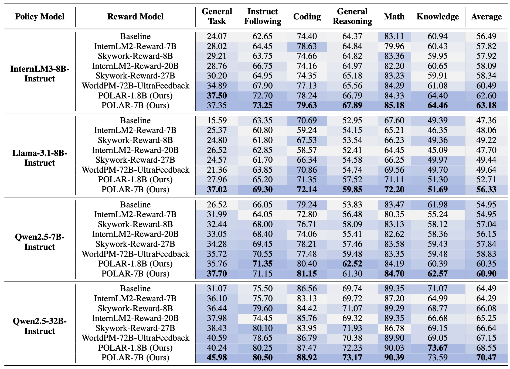

<div align="center">

<br>


[](./LICENSE)
[](https://github.com/InternLM/xtuner/)
[](https://github.com/InternLM/lmdeploy/)
[](https://github.com/sgl-project/sglang/)
[](https://github.com/vllm-project/vllm/)


[🤗 HuggingFace](https://huggingface.co/collections/internlm/polar-68693f829d2e83ac5e6e124a) |
[🤖 ModelScope](https://www.modelscope.cn/organization/Shanghai_AI_Laboratory) |
[📜 Paper](https://arxiv.org/abs/2507.05197)<br>


[English](./README.md) |
[简体中文](./README_zh-CN.md)

</div>

# 简介

POLAR 是一个经过大规模预训练的奖励模型，在训练范式和模型性能上取得了重大突破。我们利用全新的策略判别学习方法（Policy Discriminative Learning，POLAR），使用大规模合成语料进行高效扩展预训练，使奖励模型能够有效区分不同的语言模型和策略分布。经过预训练的 POLAR 可通过少量的偏好数据进行微调，以快速对齐人类偏好。POLAR 的主要特点包括：

* **全新的预训练范式**：POLAR 让奖励模型学会识别相同的策略并区分不同的策略。与传统的依赖绝对偏好的奖励建模方法不同，POLAR 能够学习两个策略之间的相对差异，是一种可扩展的、高层次的优化目标。

* **专为强化学习微调（RFT）设计:**  POLAR 根据给定的参考答案为语言模型的输出打分，完美契合强化学习微调（RFT）框架，为强化学习微调在通用场景的应用提供了一种有效解决方案。

* **卓越的性能与泛化能力:** POLAR 在下游强化学习任务中展现出领先的水平，可稳定地提供准确可靠的奖励信号。POLAR 具有极强的泛化能力，可有效泛化到分布外场景，并显著减少奖励黑客（Reward Hacking）的现象。

* **易于定制化:**  我们提供了 POLAR 的预训练权重（POLAR-Base）。研究人员可以根据自身需求，便捷地对其进行微调以适配各种定制化场景。

<br><br>


# 模型库

此次发布的 POLAR 模型参数规模分别为 1.8B 和 7B。**POLAR-1.8B-Base** 和 **POLAR-7B-Base** 是仅经过预训练阶段的权重，适合根据特定需求进行微调。**POLAR-1.8B** 和 **POLAR-7B** 是经过偏好微调的奖励模型，可开箱即用，适用于大部分通用场景。

| 模型                      | Transformers(HF)                           | ModelScope(HF)                           |
| -------------------------- | ------------------------------------------ | ---------------------------------------- |
| **POLAR-1.8B-Base**       | [🤗 POLAR-1_8B-Base](https://huggingface.co/internlm/POLAR-1_8B-Base) | [🤖 POLAR-1_8B-Base](https://modelscope.cn/models/Shanghai_AI_Laboratory/POLAR-1_8B-Base/summary) |
| **POLAR-1.8B**  | [🤗 POLAR-1_8B](https://huggingface.co/internlm/POLAR-1_8B) | [🤖 POLAR-1_8B](https://modelscope.cn/models/Shanghai_AI_Laboratory/POLAR-1_8B/summary) |
| **POLAR-7B-Base**         | [🤗 POLAR-7B-Base](https://huggingface.co/internlm/POLAR-7B-Base) | [🤖 POLAR-7B-Base](https://modelscope.cn/models/Shanghai_AI_Laboratory/POLAR-7B-Base/summary) |
| **POLAR-7B**    | [🤗 POLAR-7B](https://huggingface.co/internlm/POLAR-7B) | [🤖 POLAR-7B](https://modelscope.cn/models/Shanghai_AI_Laboratory/POLAR-7B/summary) |


# 性能

我们通过 Proximal Policy Optimization（PPO）算法对 POLAR 的使用效果进行了验证，评测了四种语言模型的下游强化学习性能，评测工具是 [OpenCompass](https://github.com/internLM/OpenCompass/) 。详细信息请参阅[论文](https://arxiv.org/abs/2507.05197)。

<br>

# 快速开始

## 安装

推荐使用最新的 [xtuner](https://github.com/InternLM/xtuner) 来微调和使用 POLAR。xtuner 是一个高效、灵活、具有多种使用特性的语言模型微调工具。

- 建议使用 conda 创建 Python-3.10 虚拟环境：

  ```bash
  conda create --name xtuner-env python=3.10 -y
  conda activate xtuner-env
  ```

- 通过 pip 安装 xtuner：

  ```shell
  pip install 'git+https://github.com/InternLM/xtuner.git@main#egg=xtuner[deepspeed]'
  ```

## 推理

我们支持通过 [lmdeploy](https://github.com/InternLM/lmdeploy/)、[sglang](https://github.com/sgl-project/sglang/)、[vllm](https://github.com/vllm-project/vllm/) 对 POLAR 进行推理并获取奖励信号。建议在使用这些推理引擎时，创建 conda 虚拟环境，以避免可能出现的依赖冲突问题。

### 数据格式

与传统奖励模型不同，POLAR 需要额外的参考答案。POLAR 对模型输出轨迹与参考答案的一致性进行评估，并给出奖励分数。

```python
data = [
    {
        "prompt": [{"role": "user", "content": "What is the capital of China?"}],
        "reference": [{"role": "assistant", "content": "Beijing."}],
        "output": [{"role": "assistant", "content": "Beijing."}]
    },
    {
        "prompt": [{"role": "user", "content": "What is the capital of China?"}],
        "reference": [{"role": "assistant", "content": "Beijing."}],
        "output": [{"role": "assistant", "content": "Shanghai."}]
    }
]
```

### 使用 transformers 进行推理

#### 示例代码

```python
from transformers import AutoModel, AutoTokenizer
from xtuner.utils import RewardModelClient

model_name = 'internlm/POLAR-7B'

model = AutoModel.from_pretrained(
    model_name,
    device_map="cuda", 
    trust_remote_code=True
)
tokenizer = AutoTokenizer.from_pretrained(model_name, trust_remote_code=True)

client = RewardModelClient(model_name)
encoded_data = client.encode(data)
batch = tokenizer(encoded_data, return_tensors='pt', padding=True).to('cuda')
outputs = model(**batch)
rewards = outputs[0].squeeze(-1).cpu().tolist()
print(rewards)
# [-0.5702977776527405, -11.030370712280273] for previous example data
```

### 使用 lmdeploy 进行推理

[LMDeploy](https://github.com/InternLM/lmdeploy) 是一个高效压缩、部署语言模型的工具。

#### 环境依赖

- lmdeploy >= 0.9.1

#### 启动服务端

```bash
lmdeploy serve api_server internlm/POLAR-7B --backend pytorch --server-port 30000
```
#### 客户端请求示例

```python
from xtuner.utils import RewardModelClient

client = RewardModelClient("internlm/POLAR-7B",
                           server_type="lmdeploy",
                           server_address="127.0.0.1:30000")

# Request rewards directly
rewards = client(data)
print(rewards)

# First encode data and then get rewards via the request function.
encoded_data = client.encode(data)
rewards = client.lmdeploy_request_reward(encoded_data)
print(rewards)
```

### 使用 sglang 进行推理

#### 环境依赖

- 0.4.3.post4 <= sglang <= 0.4.4.post1

#### 启动服务端

```bash
python3 -m sglang.launch_server --model internlm/POLAR-7B --trust-remote-code --is-embedding --dp 4 --tp 2 --mem-fraction-static 0.9 --port 30000
```

#### 客户端请求示例

```python
from xtuner.utils import RewardModelClient

client = RewardModelClient("internlm/POLAR-7B",
                           server_type="sglang",
                           server_address="127.0.0.1:30000")

# Request rewards directly
rewards = client(data)
print(rewards)

# First encode data and then get rewards via the request function.
encoded_data = client.encode(data)
rewards = client.sglang_request_reward(encoded_data)
print(rewards)
```

### 使用 vllm 进行推理

#### 环境依赖

- vllm >= 0.8.0

#### 启动服务端

```bash
vllm serve internlm/POLAR-7B --task=reward --trust-remote-code --tensor-parallel-size=2 --port 30000
```

#### 客户端请求示例

```python
from xtuner.utils import RewardModelClient

client = RewardModelClient("internlm/POLAR-7B",
                           server_type="vllm",
                           server_address="127.0.0.1:30000")

# Request rewards directly
rewards = client(data)
print(rewards)

# First encode data and then get rewards via the request function.
encoded_data = client.encode(data)
rewards = client.vllm_request_reward(encoded_data)
print(rewards)
```

## 偏好微调

### 环境依赖

- flash_attn
- tensorboard

### 数据格式

与传统的奖励模型不同，除了 chosen 轨迹和 rejected 轨迹，POLAR 在微调过程中还需要一个额外的参考答案作为示范。你可以通过构建一个 `train.jsonl` 的文件来准备微调数据，格式如下：

```json
{
    "prompt": [{"role": "user", "content": "What is the capital of China?"}],
    "reference": [{"role": "assistant", "content": "Beijing."}],
    "chosen": [{"role": "assistant", "content": "Beijing."}],
    "rejected": [{"role": "assistant", "content": "Shanghai."}]
}
```

### 训练步骤

- **第一步:** 准备配置文件。我们提供了可直接使用的[示例配置](./examples/xtuner_configs/POLAR_7B_full_varlenattn_custom_dataset.py)。如果需要进一步对超参进行修改，请复制一份示例配置文件，并根据 [xtuner 使用指南](https://github.com/InternLM/xtuner/blob/main/docs/en/get_started/quickstart.md) 进行修改。有关奖励模型训练设置的更多信息，请参考 [xtuner 奖励模型](https://github.com/InternLM/xtuner/blob/main/docs/en/reward_model/modify_settings.md)。

- **第二步:** 启动微调。

    ```shell
    xtuner train ${CONFIG_FILE_PATH}
    ```

    例如，你可以按照如下的方式微调 POLAR-7B-Base：
  ```shell
  # On a single GPU
  xtuner train ./examples/xtuner_configs/POLAR_7B_full_varlenattn_custom_dataset.py --deepspeed deepspeed_zero2

  # On multiple GPUs
  NPROC_PER_NODE=${GPU_NUM} xtuner train ./examples/xtuner_configs/POLAR_7B_full_varlenattn_custom_dataset.py --deepspeed deepspeed_zero2
  ```

  这里，`--deepspeed` 表示使用 [DeepSpeed](https://github.com/microsoft/DeepSpeed) 来加速训练。xtuner 内置了多种 DeepSpeed 策略，包括 ZeRO-1、ZeRO-2 和 ZeRO-3。如果您想禁用此功能，只需移除此参数即可。

- **第三步:** 将保存的 PTH 模型（若使用 DeepSpeed，则保存结果会是一个目录）转换为 HuggingFace 模型，命令如下：

  ```shell
  xtuner convert pth_to_hf ${CONFIG_FILE_PATH} ${PTH} ${SAVE_PATH}
  ```
<br>

# 效果示例

## 客观问答

```python
from xtuner.utils import RewardModelClient

prompt = "单词“strawberry”中有几个“r”？"
reference = "单词“strawberry”中包含3个字母“r”。我们可以逐字母数一下：“s”、“t”、“r”、“a”、“w”、“b”、“e”、“r”、“r”、“y”。因此，答案是3。"
outputs = [
    # 与参考完全一致
    "单词“strawberry”中包含3个字母“r”。我们可以逐字母数一下：“s”、“t”、“r”、“a”、“w”、“b”、“e”、“r”、“r”、“y”。因此，答案是3。",
    # 思路正确，答案正确
    "我们来数一数单词“strawberry”中有几个“r”：“s”、“t”、“r”、“a”、“w”、“b”、“e”、“r”、“r”、“y”。这里一共有三个“r”，因此答案是三。",
    # 思路错误，答案错误
    "我们来数一数单词“strawberry”中有几个“r”：“s”、“t”、“r”、“a”、“w”、“b”、“e”、“r”、“r”、“y”。这里一共有两个“r”，因此答案是二。",
    # 思路错误，答案正确
    "我们来数一数单词“strawberry”中有几个“r”：“s”、“t”、“r”、“a”、“w”、“b”、“e”、“r”、“r”、“y”。这里一共有两个“r”，因此答案是三。",
    # 思路正确，答案错误
    "我们来数一数单词“strawberry”中有几个“r”：“s”、“t”、“r”、“a”、“w”、“b”、“e”、“r”、“r”、“y”。这里一共有三个“r”，因此答案是二。",
    # 答案正确
    "单词“strawberry”中有3个“r”",
    # 答案错误
    "单词“strawberry”中有2个“r”"
]
data = [{"prompt": prompt, "reference": reference, "output": output} for output in outputs]

client = RewardModelClient("internlm/POLAR-7B", server_type="sglang", server_address="127.0.0.1:30000")
rewards = client(data)

sorted_res = sorted(zip(outputs, rewards), key=lambda x: x[1], reverse=True)

for output, reward in sorted_res:
    print(f"Output: {output}\nReward: {reward}\n")
```

```txt
Output: 单词“strawberry”中包含3个字母“r”。我们可以逐字母数一下：“s”、“t”、“r”、“a”、“w”、“b”、“e”、“r”、“r”、“y”。因此，答案是3。
Reward: -1.5380859375

Output: 我们来数一数单词“strawberry”中有几个“r”：“s”、“t”、“r”、“a”、“w”、“b”、“e”、“r”、“r”、“y”。这里一共有三个“r”，因此答案是三。
Reward: -2.767578125

Output: 单词“strawberry”中有3个“r”
Reward: -7.45703125

Output: 我们来数一数单词“strawberry”中有几个“r”：“s”、“t”、“r”、“a”、“w”、“b”、“e”、“r”、“r”、“y”。这里一共有三个“r”，因此答案是二。
Reward: -7.6328125

Output: 我们来数一数单词“strawberry”中有几个“r”：“s”、“t”、“r”、“a”、“w”、“b”、“e”、“r”、“r”、“y”。这里一共有两个“r”，因此答案是三。
Reward: -8.65625

Output: 我们来数一数单词“strawberry”中有几个“r”：“s”、“t”、“r”、“a”、“w”、“b”、“e”、“r”、“r”、“y”。这里一共有两个“r”，因此答案是二。
Reward: -9.2890625

Output: 单词“strawberry”中有2个“r”
Reward: -11.921875
```

## 主观问答
```python
from xtuner.utils import RewardModelClient

prompt = "帮我想3个形容雨很大的成语，要求不能重复。"
reference = "1. 倾盆大雨 2. 暴雨如注 3. 瓢泼大雨"
outputs = [
    # 与参考相同
    "1. 倾盆大雨 2. 暴雨如注 3. 瓢泼大雨",
    # 正确回答
    "1. 大雨滂沱 2. 狂风骤雨 3. 大雨如注",
    # 非成语
    "1. 急雨如瀑 2. 豪雨倾天 3. 雨势磅礴",
    # 与参考类似，多一个。
    "1. 倾盆大雨 2. 暴雨如注 3. 瓢泼大雨 4. 大雨滂沱",
    # 与参考类似，重复一个。
    "1. 倾盆大雨 2. 暴雨如注 3. 暴雨如注",
    # 与参考类似，少一个。
    "1. 倾盆大雨 2. 暴雨如注",
    # 成语正确，多一个。
    "1. 大雨滂沱 2. 狂风骤雨 3. 大雨如注 4. 倾盆大雨", 
    # 成语正确，重复一个
    "1. 大雨滂沱 2. 狂风骤雨 3. 狂风骤雨",
    # 成语正确，少一个
    "1. 大雨滂沱 2. 狂风骤雨"
]
data = [{"prompt": prompt, "reference": reference, "output": output} for output in outputs]

client = RewardModelClient("internlm/POLAR-7B", server_type="sglang", server_address="127.0.0.1:30000")
rewards = client(data)

sorted_res = sorted(zip(outputs, rewards), key=lambda x: x[1], reverse=True)

for output, reward in sorted_res:
    print(f"Output: {output}\nReward: {reward}\n")
```

```txt
Output: 1. 倾盆大雨 2. 暴雨如注 3. 瓢泼大雨
Reward: -1.42578125

Output: 1. 大雨滂沱 2. 狂风骤雨 3. 大雨如注
Reward: -5.234375

Output: 1. 倾盆大雨 2. 暴雨如注 3. 瓢泼大雨 4. 大雨滂沱
Reward: -5.62890625

Output: 1. 急雨如瀑 2. 豪雨倾天 3. 雨势磅礴
Reward: -5.7109375

Output: 1. 倾盆大雨 2. 暴雨如注
Reward: -6.61328125

Output: 1. 倾盆大雨 2. 暴雨如注 3. 暴雨如注
Reward: -6.65234375

Output: 1. 大雨滂沱 2. 狂风骤雨
Reward: -6.828125

Output: 1. 大雨滂沱 2. 狂风骤雨 3. 大雨如注 4. 倾盆大雨
Reward: -7.0234375

Output: 1. 大雨滂沱 2. 狂风骤雨 3. 狂风骤雨
Reward: -7.23046875
```

# 许可证

代码和模型权重均采用 Apache-2.0 许可证。

# 引用

```
@article{dou2025pretrained,
  title={Pre-Trained Policy Discriminators are General Reward Models},
  author={Dou, Shihan and Liu, Shichun and Yang, Yuming and Zou, Yicheng and Zhou, Yunhua and Xing, Shuhao and Huang, Chenhao and Ge, Qiming and Song, Demin and Lv, Haijun and others},
  journal={arXiv preprint arXiv:2507.05197},
  year={2025}
}
```
